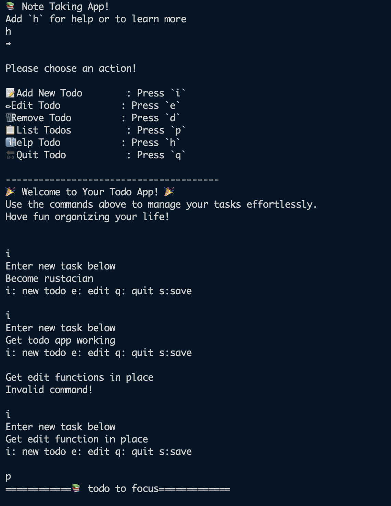
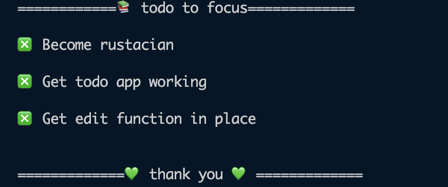

# TODO LIST APP.

## Working


## PRINT



## Saved JSON.

```json


{
  "list": [
    {
      "description": "save to jason file is in place",
      "completed": false,
      "id": 1
    },
    {
      "description": "listing to json file is also in place",
      "completed": false,
      "id": 2
    },
    {
      "description": "goes to new todo",
      "completed": false,
      "id": 3
    },
    {
      "description": "saving now to json",
      "completed": false,
      "id": 4
    }
  ]
}

```
