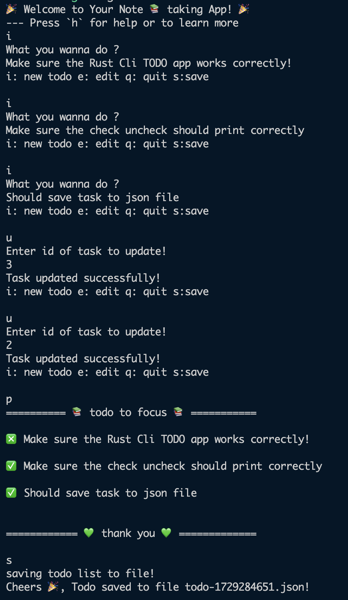

# TODO LIST APP.

## Working app demo


## Saved JSON.

```json

{
  "list": [
    {
      "description": "Make sure the Rust Cli TODO app works correctly!",
      "completed": false,
      "id": 1
    },
    {
      "description": "Make sure the check uncheck should print correctly",
      "completed": true,
      "id": 2
    },
    {
      "description": "Should save task to json file",
      "completed": true,
      "id": 3
    }
  ]
}

```

## Learned by building app
 - how to use `trai` `struct` `impl` `impl for method`
 - how to write `function` `Vec`
 - how to use `enum` and make better use of `match`
 - how to read command line input from user `io::stdin::read_line`
 - explore the `loops`, `filter`, `maps`, `iter_mut`, `find`
 - crate like `serde` & `serde_json` to serialize vec data to string
 - how to save file in json format
 - last but not least borrowing & referencing.


## Action item.

[Task list to learn](./task.md)