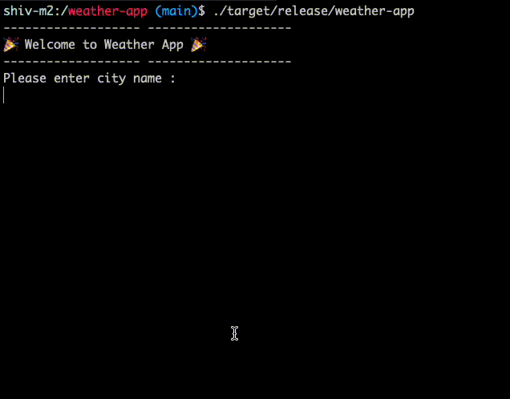

# 🎉 Welcome to Weather App 🎉

## Working app demo
<!-- [video](./demo.mov) -->

## What we have learned.

- Use of `loop`, `match`
- Extracting the Result & Error Chain
- fetching api data with `reqwest::get` and parsing json with Struct.
- Deserialize with serde
- Initiating the dot env and fetch env params from `.env`
- Way to clear the terminal screen with cross term.